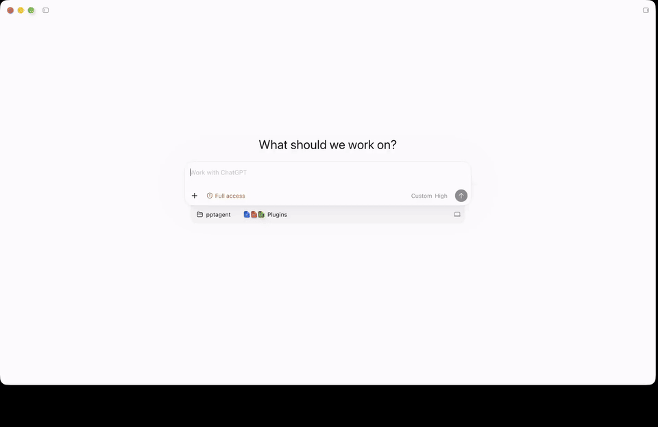

<h1 align="center">
  
</h1>

> [!TIP]
> **PPTAgent Skill for Claude Code, Codex & OpenCode Now Available!**
>
> Create, revise, and visually review editable PowerPoint decks with your coding agent.
>
> **[Install the Skill →](#install-skill)** · **[Use Atria Dawn Preview →](#quick-start)**
>
> **Free Token Plan:** [Discovery](https://discovery-home.intern-ai.org.cn/) · [Atria API](https://api.atria-asi.ai/)
>
> You can use a multimodal vision model as a multimodal reviewer and apply for an API token through the [Duanyan (端砚) Token Plan](https://discovery.intern-ai.org.cn/token-plan/home?tabIndex=1). We recommend `deepseek-v4-flash-vision` as the multimodal model. [Setup guide →](skills/pptagent/README.md#visual-review)

> [!IMPORTANT]
> **Looking for the previous runtime or reproducing the research papers?** Use
> these pinned versions instead of the current development branch:
>
> - **Complete pre-Skill repository:** [v2.1.0](https://github.com/icip-cas/PPTAgent/tree/v2.1.0)
> - **PPTAgent (EMNLP 2025):** [paper](https://arxiv.org/abs/2501.03936) · [code at v0.2.0](https://github.com/icip-cas/PPTAgent/tree/v0.2.0)
> - **DeepPresenter (ACL 2026):** [paper](https://arxiv.org/abs/2602.22839) · [code at v1.1.37](https://github.com/icip-cas/PPTAgent/tree/v1.1.37)

<p align="center">
  
</p>

## 📅 News

- **[2026/09]** 🚀 Introducing **Atria Dawn Preview**, a new agentic model jointly released by Shanghai AI Laboratory, Fudan University, the Institute of Software (Chinese Academy of Sciences), Renmin University of China, the Institute of Automation (Chinese Academy of Sciences), and East China Normal University. **Claim a generous free Token Plan:** [Discovery](https://discovery-home.intern-ai.org.cn/) · [Atria](https://api.atria-asi.ai/). [Use Atria with PPTAgent Skill →](skills/pptagent/README.md#try-atria)
- **[2026/09]** 🧩 Released **[PPTAgent Skill](skills/pptagent/README.md)** for **Claude Code, Codex & OpenCode** — create, visually review, and export editable PowerPoint decks with your coding agent. [Get started →](skills/pptagent/README.md#quick-start)
- **[2026/04]** 🎉 [DeepPresenter](https://arxiv.org/abs/2602.22839) accepted to **ACL 2026**!
- **[2026/03]** 🤗 We released fine-tuned models and taskset on [Hugging Face](https://huggingface.co/collections/ICIP/deeppresenter).
- **[2026/01]** 🆕 Freeform & template generation now support PPTX export and offline mode. Context management added to prevent context overflow.
- **[2025/12]** 🔥 Released **DeepPresenter** codebase with major upgrades — Deep Research Integration, Free-Form Visual Design, Autonomous Asset Creation, Text-to-Image Generation, and an Agent Environment with sandbox & 20+ tools.
- **[2025/09]** 🛠️ MCP server support added — see the [v1.1.37 documentation](https://github.com/icip-cas/PPTAgent/blob/v1.1.37/pptagent/DOC.md#mcp-server-) for details.
- **[2025/08]** 🎉 [PPTAgent](https://arxiv.org/abs/2501.03936) accepted to **EMNLP 2025**!
- **[2025/05]** ⭐ Reached **1,000 stars** on GitHub!
- **[2025/01]** 🔓 Open-sourced the PPTAgent codebase.

<a id="install-skill"></a>

## Install PPTAgent Skill 🧩

**Requirements:** Claude Code, Codex CLI, or OpenCode; Linux (including WSL) or macOS; [uv](https://docs.astral.sh/uv/getting-started/installation/); npm; and LibreOffice available as `libreoffice` on PATH. On macOS, also install Google Chrome for the converter.

### 1. Install the runtime

On Debian/Ubuntu, install the system dependencies first:

```bash
sudo apt-get install npm libreoffice-impress
```

On macOS, install the system dependencies with Homebrew:

```bash
brew install node
brew install --cask libreoffice google-chrome
ln -sf "$(command -v soffice)" "$(brew --prefix)/bin/libreoffice"
```

Clone the repository and install the skill's dependencies. If you already have a checkout, start from its `skills/pptagent/` directory:

```bash
git clone https://github.com/icip-cas/PPTAgent.git
cd PPTAgent/skills/pptagent

uv venv --python 3.12 .venv
uv pip install --python .venv/bin/python -r requirements.txt
.venv/bin/python -m playwright install --with-deps chromium
```

### 2. Register with your coding agent

Run the command for your client from `skills/pptagent/`.

**Claude Code**

```bash
.venv/bin/python scripts/install.py --client claude
```

**Codex CLI**

```bash
.venv/bin/python scripts/install.py --client codex
```

**OpenCode**

```bash
.venv/bin/python scripts/install.py --client opencode
```

The installer prepares Node dependencies and registers the skill for the selected client. Keep the repository in place, then check the installation:

```bash
.venv/bin/python scripts/pptagent.py doctor
```

For OpenCode visual MCP configuration and the complete workflow, continue with
the [OpenCode setup guide](skills/pptagent/README.md#opencode-setup).

<a id="quick-start"></a>

## Quick Start with Atria Dawn Preview 🚀

This example uses **Atria Dawn Preview** to write and revise the slides, with an external visual model to review them. Complete the installation above, then create an API key in the [Atria console](https://api.atria-asi.ai/console/keys).

### 1. Set up text-mode visual review

You can use a multimodal vision model as a multimodal reviewer and apply for an API token through the [Duanyan (端砚) Token Plan](https://discovery.intern-ai.org.cn/token-plan/home?tabIndex=1). We recommend `deepseek-v4-flash-vision` as the multimodal model.

In `skills/pptagent/config.yaml`, use the example below and replace `base_url` with the OpenAI-compatible API base URL shown in your Duanyan console:

```yaml
mode: text
visual:
  base_url: "<OpenAI-compatible API base URL from the Duanyan console>"
  model: "deepseek-v4-flash-vision"
  api_key_env: VISUAL_API_KEY
  timeout_seconds: 300
delivery:
  mode: strict
```

Save your Duanyan API key in `skills/pptagent/.env`:

```dotenv
VISUAL_API_KEY=<your-duanyan-api-key>
```

Atria writes the slides through the text workflow; `deepseek-v4-flash-vision` reviews the rendered images. The skill appends `/chat/completions` to `base_url`; use the API prefix from the console, not the Token Plan webpage URL. With an image-capable host model, you can use `mode: multimodal` instead. See [visual review configuration](skills/pptagent/README.md#visual-review) for details.

### 2. Launch your coding agent with Atria

Set your Atria key and open a separate task folder:

```bash
export ATRIA_API_KEY="<your-atria-api-key>"
mkdir -p ~/pptagent-demo
cd ~/pptagent-demo
```

Choose the client you registered during installation.

**Claude Code** — launch through Atria's Messages API:

```bash
ANTHROPIC_BASE_URL=https://api.atria-asi.ai \
ANTHROPIC_AUTH_TOKEN="$ATRIA_API_KEY" \
claude --model Atria-Dawn-Preview
```

**Codex CLI** — merge the following into `~/.codex/config.toml`. Keep `model` and `model_provider` at the top level, before any section headers, and update existing entries rather than duplicating them:

```toml
model = "Atria-Dawn-Preview"
model_provider = "atria"

[model_providers.atria]
name = "Atria"
base_url = "https://api.atria-asi.ai/v1"
env_key = "ATRIA_API_KEY"
wire_api = "responses"
```

Then run `codex` from the same terminal. It uses Atria's Responses API and reads `ATRIA_API_KEY` from your environment.

**OpenCode** — configure Atria through your normal OpenCode provider settings,
then follow the [OpenCode setup guide](skills/pptagent/README.md#opencode-setup)
to connect the visual review tools.

### 3. Create your first presentation

Send this request in your Atria-powered session:

```text
Use the pptagent skill to create a 6-slide presentation about how our
engineering team can adopt AI coding assistants. Use a clean 16:9 layout.
Render and visually review the slides and the exported deck, then deliver
an editable answer.pptx.
```

You can also invoke the skill explicitly with `/pptagent` in Claude Code or `$pptagent` in Codex. In OpenCode, ask it to use the `pptagent` skill. Continue in the same session to revise the deck:

```text
Turn slide 3 into a workflow diagram and shorten the recommendations.
Keep the deck at 6 slides, rebuild it, and review the updated PPTX.
```

Your task folder keeps **`answer.pptx`**, editable HTML sources, previews, and the review report. See the [Skill guide](skills/pptagent/README.md) for details and [optional MinerU and search tools](skills/pptagent/README.md#configuration) for richer source material.

## Contributors 🌟

<table>
<tr>
    <td align="center" style="word-wrap: break-word; width: 120.0; height: 120.0">
        <a href=https://github.com/Force1ess>
            
            <br />
            <sub style="font-size:14px"><b>Force1ess</b></sub>
        </a>
    </td>
    <td align="center" style="word-wrap: break-word; width: 120.0; height: 120.0">
        <a href=https://github.com/Puellaquae>
            
            <br />
            <sub style="font-size:14px"><b>Puelloc</b></sub>
        </a>
    </td>
    <td align="center" style="word-wrap: break-word; width: 120.0; height: 120.0">
        <a href=https://github.com/hysyyds>
            
            <br />
            <sub style="font-size:14px"><b>hongyan</b></sub>
        </a>
    </td>
    <td align="center" style="word-wrap: break-word; width: 120.0; height: 120.0">
        <a href=https://github.com/imHuZijian>
            
            <br />
            <sub style="font-size:14px"><b>BrandonHu</b></sub>
        </a>
    </td>
    <td align="center" style="word-wrap: break-word; width: 120.0; height: 120.0">
        <a href=https://github.com/Dnoob>
            
            <br />
            <sub style="font-size:14px"><b>Dnoob</b></sub>
        </a>
    </td>
</tr>
<tr>
    <td align="center" style="word-wrap: break-word; width: 120.0; height: 120.0">
        <a href=https://github.com/lnennnn>
            
            <br />
            <sub style="font-size:14px"><b>lnennnn</b></sub>
        </a>
    </td>
    <td align="center" style="word-wrap: break-word; width: 120.0; height: 120.0">
        <a href=https://github.com/Sadahlu>
            
            <br />
            <sub style="font-size:14px"><b>Sadahlu</b></sub>
        </a>
    </td>
    <td align="center" style="word-wrap: break-word; width: 120.0; height: 120.0">
        <a href=https://github.com/KurisuMakiseSame>
            
            <br />
            <sub style="font-size:14px"><b>KurisuMakiseSame</b></sub>
        </a>
    </td>
    <td align="center" style="word-wrap: break-word; width: 120.0; height: 120.0">
        <a href=https://github.com/RheagalFire>
            
            <br />
            <sub style="font-size:14px"><b>Aarish Alam</b></sub>
        </a>
    </td>
    <td align="center" style="word-wrap: break-word; width: 120.0; height: 120.0">
        <a href=https://github.com/Angelenx>
            
            <br />
            <sub style="font-size:14px"><b>Angelen</b></sub>
        </a>
    </td>
</tr>
<tr>
    <td align="center" style="word-wrap: break-word; width: 120.0; height: 120.0">
        <a href=https://github.com/kylooh>
            
            <br />
            <sub style="font-size:14px"><b>Eliot White</b></sub>
        </a>
    </td>
    <td align="center" style="word-wrap: break-word; width: 120.0; height: 120.0">
        <a href=https://github.com/EvolvedGhost>
            
            <br />
            <sub style="font-size:14px"><b>EvolvedGhost</b></sub>
        </a>
    </td>
    <td align="center" style="word-wrap: break-word; width: 120.0; height: 120.0">
        <a href=https://github.com/ISCAS-zwl>
            
            <br />
            <sub style="font-size:14px"><b>ISCAS-zwl</b></sub>
        </a>
    </td>
    <td align="center" style="word-wrap: break-word; width: 120.0; height: 120.0">
        <a href=https://github.com/James4Ever0>
            
            <br />
            <sub style="font-size:14px"><b>白雨 | James Brown</b></sub>
        </a>
    </td>
    <td align="center" style="word-wrap: break-word; width: 120.0; height: 120.0">
        <a href=https://github.com/LasRuinasCirculares>
            
            <br />
            <sub style="font-size:14px"><b>JunZhang</b></sub>
        </a>
    </td>
</tr>
<tr>
    <td align="center" style="word-wrap: break-word; width: 120.0; height: 120.0">
        <a href=https://github.com/openaitx-system>
            
            <br />
            <sub style="font-size:14px"><b>Open AI Tx</b></sub>
        </a>
    </td>
    <td align="center" style="word-wrap: break-word; width: 120.0; height: 120.0">
        <a href=https://github.com/haosenwang1018>
            
            <br />
            <sub style="font-size:14px"><b>Sense_wang</b></sub>
        </a>
    </td>
    <td align="center" style="word-wrap: break-word; width: 120.0; height: 120.0">
        <a href=https://github.com/DeJeune>
            
            <br />
            <sub style="font-size:14px"><b>SuYao</b></sub>
        </a>
    </td>
    <td align="center" style="word-wrap: break-word; width: 120.0; height: 120.0">
        <a href=https://github.com/JiwaniZakir>
            
            <br />
            <sub style="font-size:14px"><b>Zakir Jiwani</b></sub>
        </a>
    </td>
    <td align="center" style="word-wrap: break-word; width: 120.0; height: 120.0">
        <a href=https://github.com/Dormiveglia-elf>
            
            <br />
            <sub style="font-size:14px"><b>Zhenyu</b></sub>
        </a>
    </td>
</tr>
<tr>
    <td align="center" style="word-wrap: break-word; width: 120.0; height: 120.0">
        <a href=https://github.com/wangzh12023>
            
            <br />
            <sub style="font-size:14px"><b>Zihan Wang</b></sub>
        </a>
    </td>
</tr>
</table>

[](https://star-history.com/#icip-cas/PPTAgent&Date)

## Citation 🙏

If you find this project helpful, please use the following to cite it:

```bibtex
@inproceedings{zheng-etal-2025-pptagent,
    title = "{PPTA}gent: Generating and Evaluating Presentations Beyond Text-to-Slides",
    author = "Zheng, Hao  and
      Guan, Xinyan  and
      Kong, Hao  and
      Zhang, Wenkai  and
      Zheng, Jia  and
      Zhou, Weixiang  and
      Lin, Hongyu  and
      Lu, Yaojie  and
      Han, Xianpei  and
      Sun, Le",
    editor = "Christodoulopoulos, Christos  and
      Chakraborty, Tanmoy  and
      Rose, Carolyn  and
      Peng, Violet",
    booktitle = "Proceedings of the 2025 Conference on Empirical Methods in Natural Language Processing",
    month = nov,
    year = "2025",
    address = "Suzhou, China",
    publisher = "Association for Computational Linguistics",
    url = "https://aclanthology.org/2025.emnlp-main.728/",
    doi = "10.18653/v1/2025.emnlp-main.728",
    pages = "14413--14429",
    ISBN = "979-8-89176-332-6",
    abstract = "Automatically generating presentations from documents is a challenging task that requires accommodating content quality, visual appeal, and structural coherence. Existing methods primarily focus on improving and evaluating the content quality in isolation, overlooking visual appeal and structural coherence, which limits their practical applicability. To address these limitations, we propose PPTAgent, which comprehensively improves presentation generation through a two-stage, edit-based approach inspired by human workflows. PPTAgent first analyzes reference presentations to extract slide-level functional types and content schemas, then drafts an outline and iteratively generates editing actions based on selected reference slides to create new slides. To comprehensively evaluate the quality of generated presentations, we further introduce PPTEval, an evaluation framework that assesses presentations across three dimensions: Content, Design, and Coherence. Results demonstrate that PPTAgent significantly outperforms existing automatic presentation generation methods across all three dimensions."
}

@misc{zheng2026deeppresenterenvironmentgroundedreflectionagentic,
      title={DeepPresenter: Environment-Grounded Reflection for Agentic Presentation Generation},
      author={Hao Zheng and Guozhao Mo and Xinru Yan and Qianhao Yuan and Wenkai Zhang and Xuanang Chen and Yaojie Lu and Hongyu Lin and Xianpei Han and Le Sun},
      year={2026},
      eprint={2602.22839},
      archivePrefix={arXiv},
      primaryClass={cs.AI},
      url={https://arxiv.org/abs/2602.22839},
}
```
